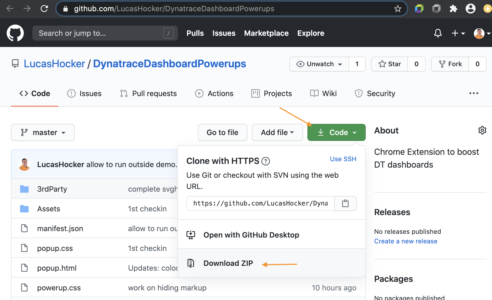
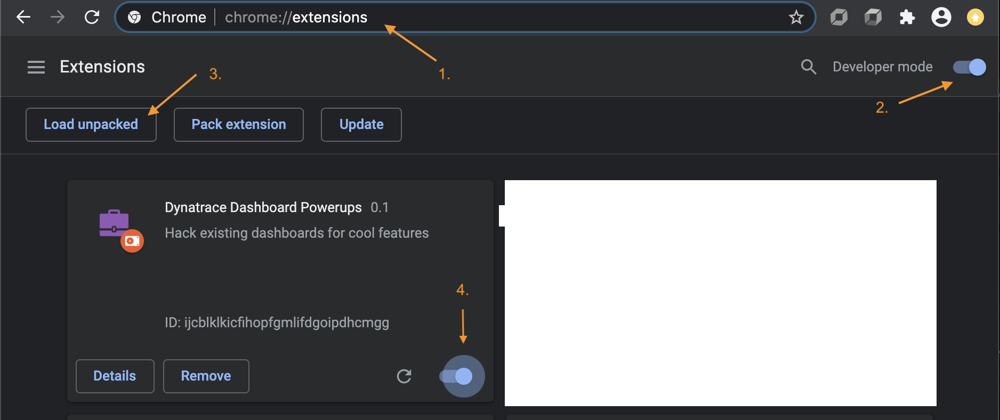

# Dynatrace Dashboard Powerups

This extension hacks Dynatrace dashboards to enable cool new features live, such as:
- Color changing tiles based on thresholds
- Color changing icons based on thresholds
- Tooltips on charts

Use the <a href="https://dynatrace.github.io/BizOpsConfigurator">BizOpsConfigurator</a> for deploying dashboards.
   
*Please note: this is a community developed demonstration application. It is provided without any representations, warranties, or support from Dynatrace. If you have questions about this app, please post on our forum*

## Installation
Download the extension source

Enable in Chrome

