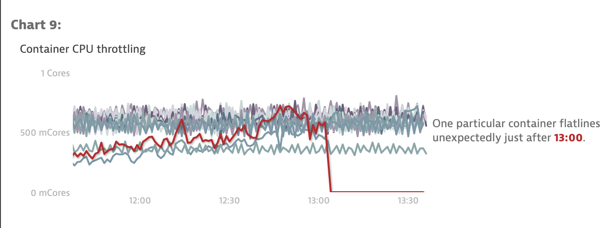
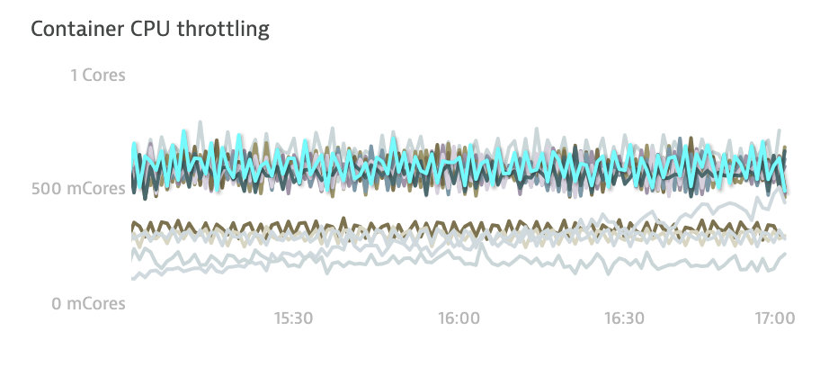
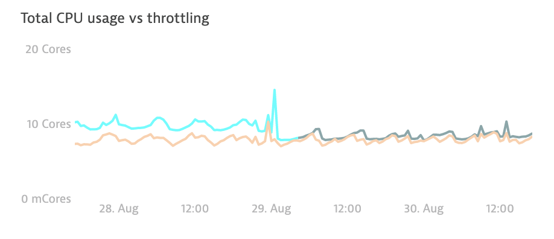
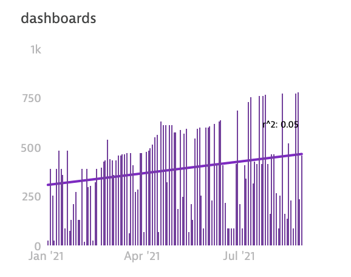
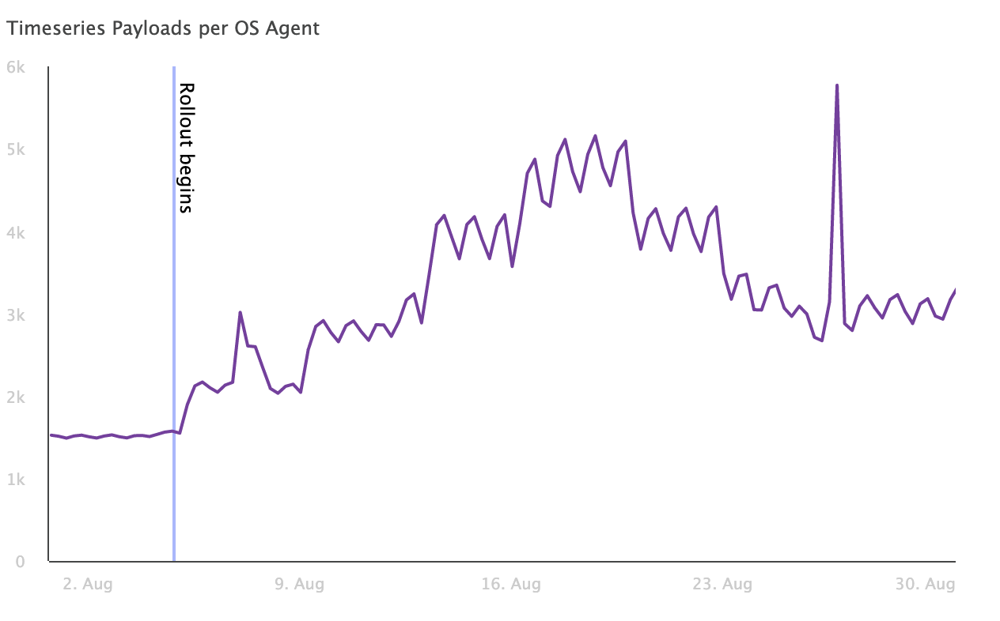
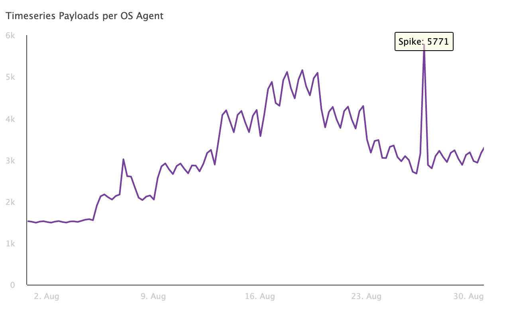
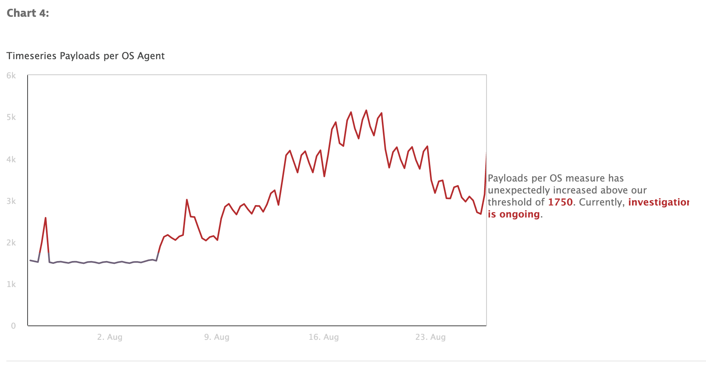
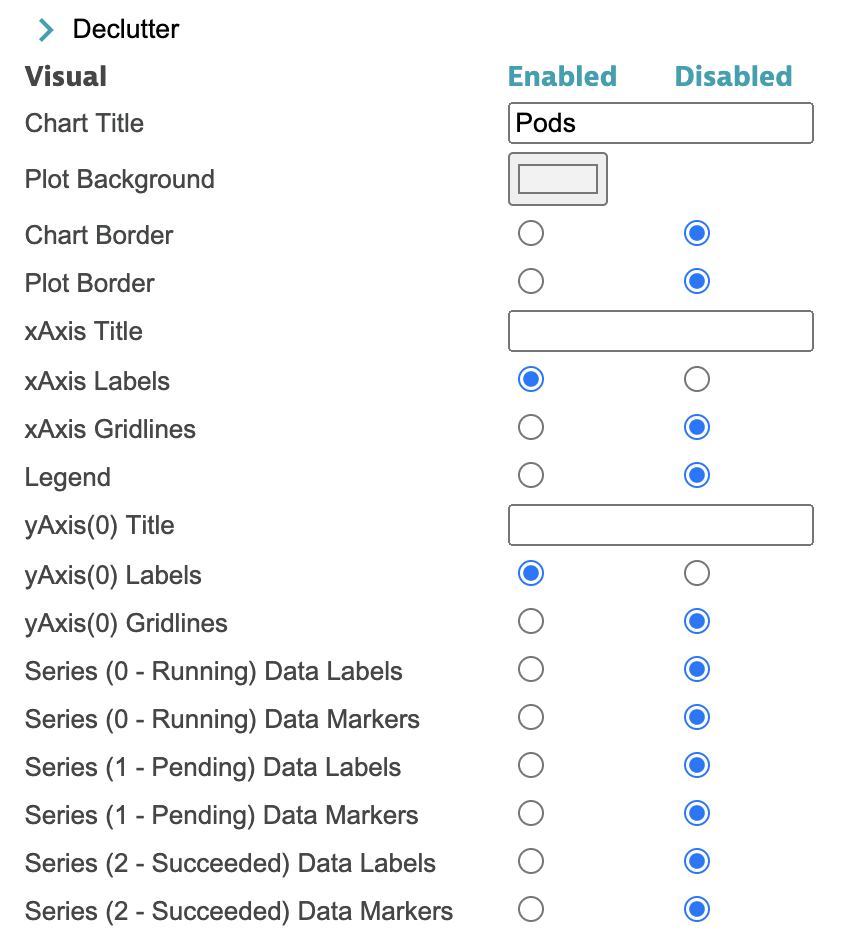
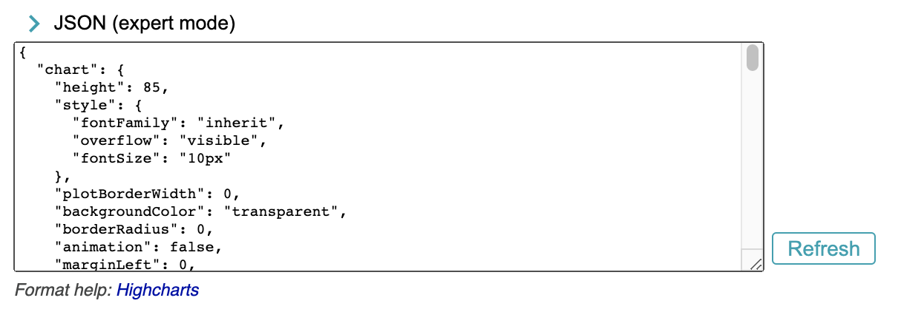

# PowerUps Reports

This portion of the extension allows you to create reports from your dashboard. You can modify the look of each chart to tell more of a "data story" for your report. When finished, you can download as:
- **PDF** e.g. for distributing via email
- **Combined SVG** e.g. for pasting into presentations
- **Zip of SVGs** (coming soon) also for pasting into presentations
Note: reports currently do not include Single-Value tiles, tables, or maps

*As with all of PowerUps, his is a community developed demonstration application. It is provided without any representations, warranties, or support from Dynatrace. If you have questions about this app, please post on our forum or create an [issue](https://github.com/LucasHocker/DynatraceDashboardPowerups/issues) on Github*

## How to
1. Open Report Generator
    1. Click PowerUp icon
    2. Click Report button
2. Click Generate
3. For each chart, modify the chart to tell your "data story"
4. Download your report as PDF or SVG

## Modifying a chart

### DataStory (presets)
These presets pick colors etc to align to your data story. For example, reds for degraded, greens for improvements, and yellow for interesting items.

### Foreground / background
To help the audience focus on the most important data, it's helpful to create a foreground and background using visual style. Foreground chart series have be brighter colors and background more muted.

### Highlight segments
Highlighting a segement of a series can draw attention to a changing trend or times when a threshold is breached.

### Trendline
To make a trend more clear for your audience, add a trendline. Currently only linear regression is supported. Optionally, include a label with R-squared value of the trendline, which can indicate how well it fits the data.

### Plot bands / lines
Denote finite or range of an axis to focus on. For example, a plot band can be used to denote a period of time when a Problem was active. Similarly, a plot line could be used to show when a reboot happened.

### Annotations
Annotations allow to you callout a specific point on the chart. Use `{x}` and `{y}` to subtitute in values.

### Narrative
Add a narrative or short paragraph to explain what the audience should really take a way from the chart. Use ** to wrap text in the narrative that should be called out.

### Declutter 
Control the minutia of the chart design. To help the audience focus on the story, as much clutter should be removed as possible.

### JSON (expert mode)
Direct control over the styling of the chart. See the Highcharts API specification for further details.

