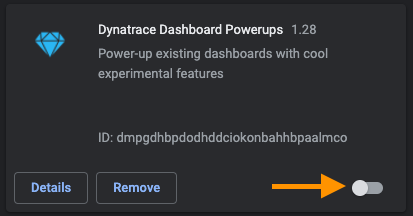
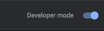
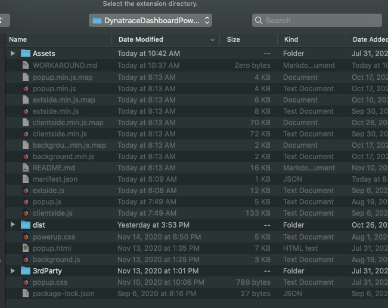

# Manual Workaround
In the event that we're stuck waiting for a bug fix from Google ChromeStore, you can use this method to load the extension locally. Please note: it will not auto-update.

Steps:
1. In your Chrome address bar, type: `chrome://extensions`
2. Disable the extension (ID: dmpgdhbpdodhddciokonbahhbpaalmco)

3. Enable Developer mode

4. Download Extension from [GitHub](https://github.com/LucasHocker/DynatraceDashboardPowerups/archive/master.zip)
5. Extract zipfile to a local directory of your choice
6. Back in Chrome extensions page, click `Load unpacked` and then pick the directory where you extracted the Extension

7. You should now have the Extension loaded as unpacked

8. Refresh you dashboard again